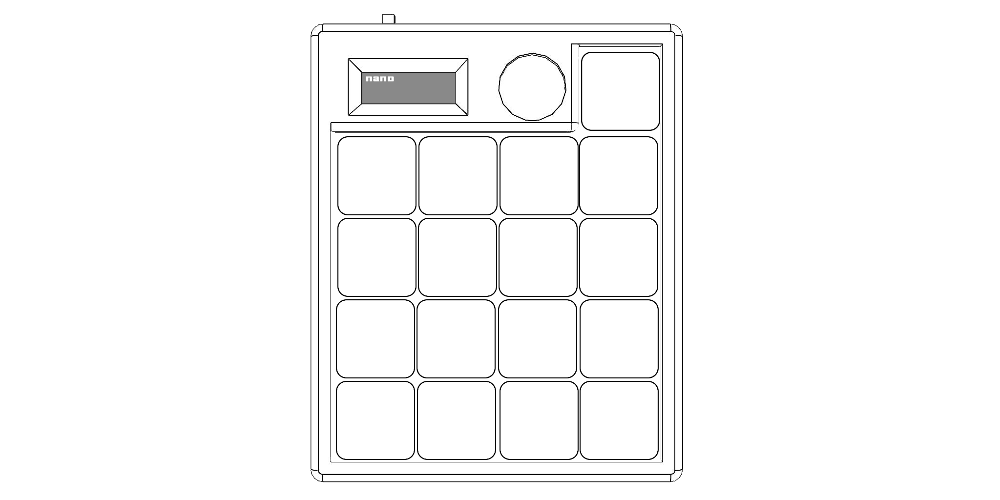

### 线框图

VoidWorks Nano（灰度测试中）

### 硬件配置

1. 蓝牙无线连接
2. 17个可编程宏按键
3. 1个旋转编码器
4. 0.91寸OLED显示屏

### 固件
**Nano键盘固件仓库：** [固件仓库](https://github.com/VoidWorks-online/firmware-release/releases)

### 配置软件
**VoidWorks键盘配置软件仓库** [配置软件仓库-待发布]

