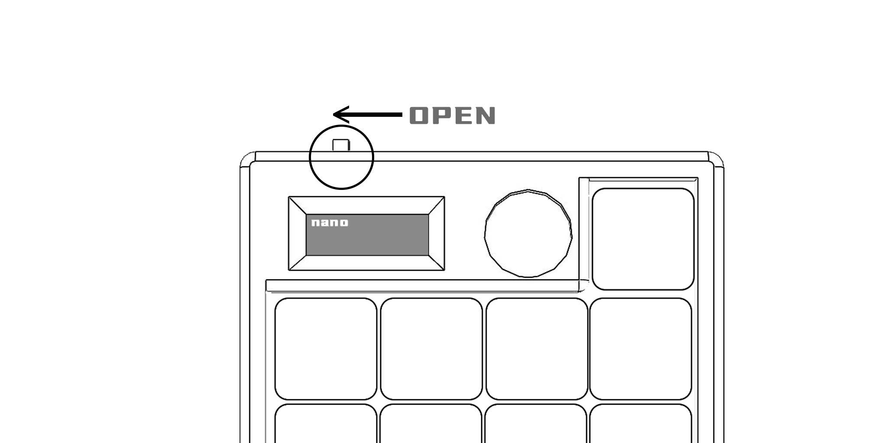
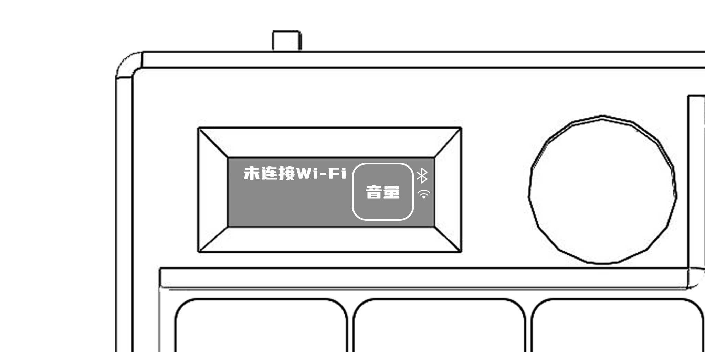
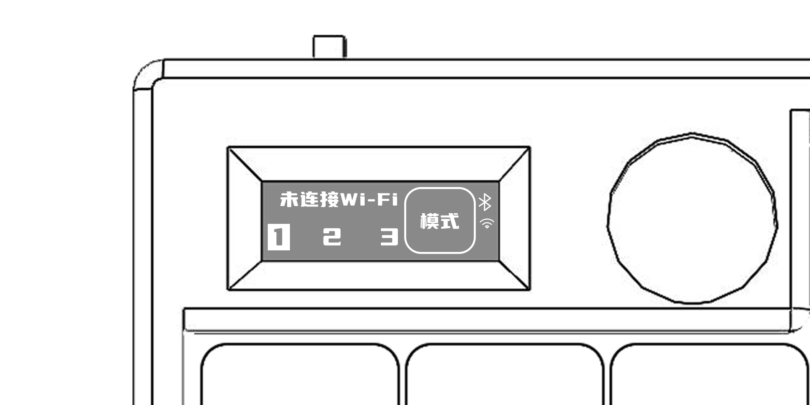
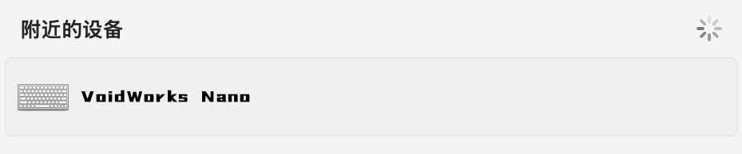
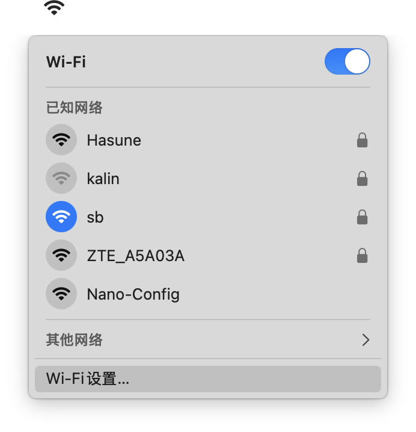
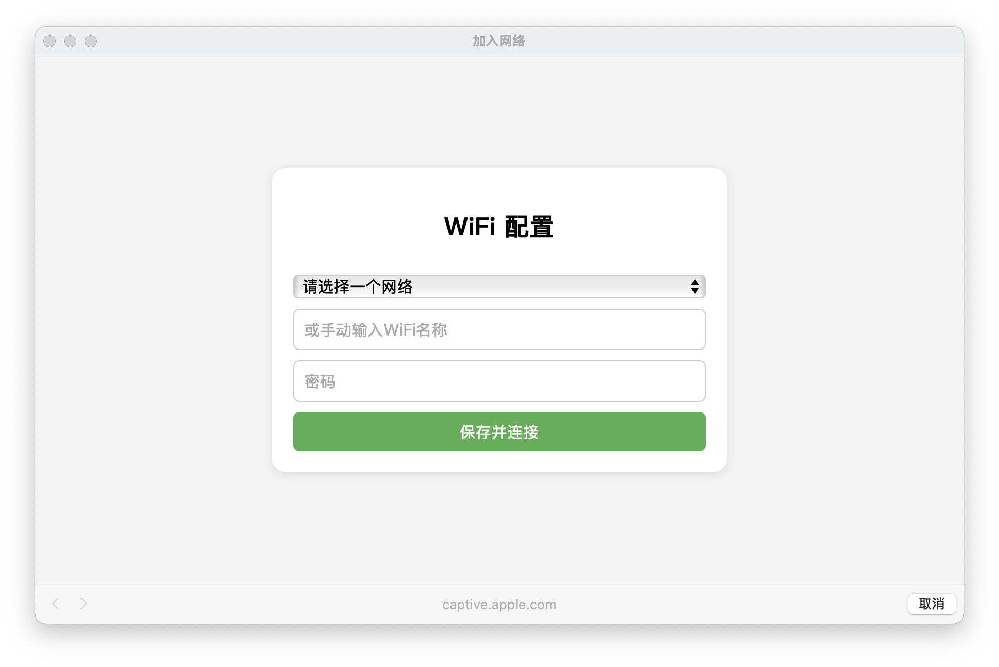

### 线框图

VoidWorks Nano（灰度测试中）

### 硬件配置

1. 蓝牙无线连接
2. 17个可编程宏按键
3. 1个旋转编码器
4. 0.91寸OLED显示屏

### 固件
**Nano键盘固件仓库：** [固件仓库](https://github.com/VoidWorks-online/firmware-release/releases)

### 配置软件
**VoidWorks键盘配置软件仓库** [配置软件仓库-待发布]

### 开始使用

#### 开机

左上侧凸起拨杆为开机按钮，左侧为开，右侧为关。

#### 屏幕内容

蓝牙尝试连接配对时闪烁，连接成功图标常亮。

在没有配置Wi-Fi时右侧Wi-Fi图标默认不会显示

在没有连接且已经配置Wi-Fi时右侧Wi-Fi图标默认闪烁，长时间闪烁可能是不在Wi-Fi信号范围或密码错误，请在 清除密码 里查看解决方案。

已正确连接Wi-Fi时，Wifi指示图标常亮，且屏幕左上角显示键盘的IP地址。

#### 旋钮功能

屏幕右侧旋钮可自定义旋转操作，默认为音量控制，短按时切换控制模式，Nano最多可写入3套按键逻辑。

#### 连接蓝牙

开启 VoidWorks Nano 键盘,蓝牙会自动广播，在电脑蓝牙设置里找到 VoidWorks Nano 的键盘设备点击连接。

#### 连接网络

连接键盘Wi-Fi网络 Nano-Config 等待弹出如下配网页面。

如果没有弹出配置窗口请连接 Nano-Config 使用浏览器访问 http://192.168.4.1 进行配置。

在下拉选项中选择Wi-Fi名称并输入密码，点击保存并连接，键盘会重新启动。

